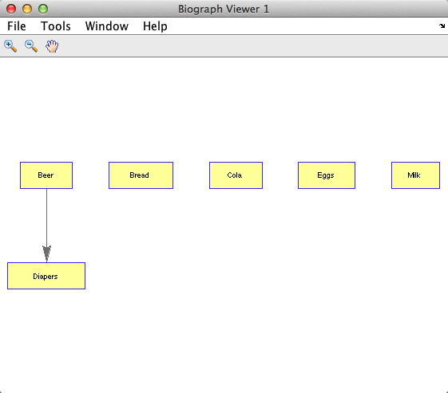
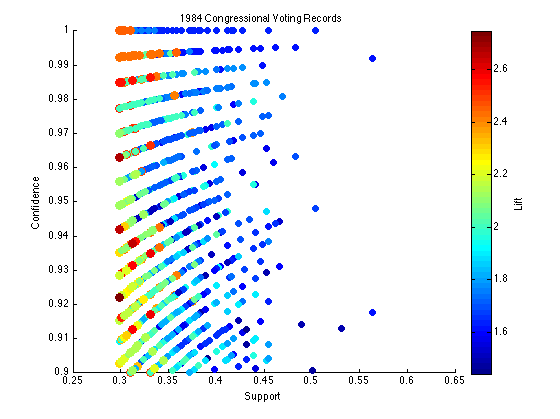
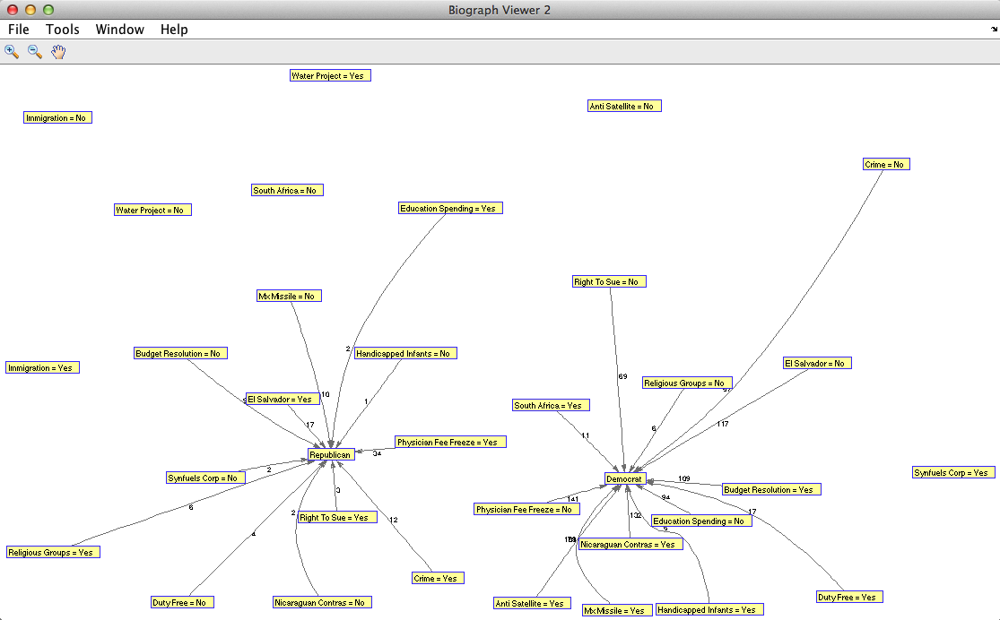
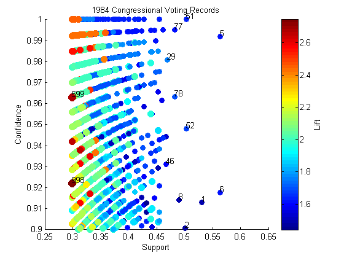
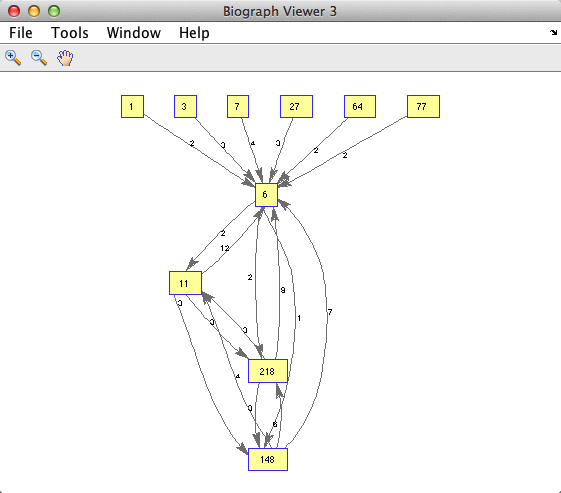

Market Basket Analysis with MATLAB
==================================

When you hear "Data Mining", the "beer and diapers" story comes to mind - supermarkets placing beer next to diapers because they mined their POS(Point-of-Sales) data and found that men often bought those two items together. 
 
This is known as **Association Analysis** or **Frequent Itemset Mining**. I don't work at a supermarket but I wanted to play with this technique for web usage pattern mining. Fortunately, a pseudo code for this algorithm is available in Chapter 6 (sample chapter available for free download) of [Introduction to Data Mining](http://www-users.cs.umn.edu/~kumar/dmbook/index.php).

Let's start with loading the example dataset used in the PDF and creating a binary matrix representation of transactions in rows and items in columns, with 1 meaning the given item was in the given transaction, but otherwise 0.

```
clearvars; close all; clc;

transactions = {{'Bread','Milk'};...
    {'Bread','Diapers','Beer','Eggs'};...
    {'Milk','Diapers','Beer','Cola'};...
    {'Bread','Milk','Diapers','Beer'};...
    {'Bread','Milk','Diapers','Cola'}};

items = unique([transactions{:}]);
T = zeros(size(transactions,1), length(items));
for i = 1:size(transactions,1)
    T(i,ismember(items,transactions{i,:})) = 1;
end
disp(array2table(T,'VariableNames',items))
```

    Beer    Bread    Cola    Diapers    Eggs    Milk
    ____    _____    ____    _______    ____    ____

    0       1        0       0          0       1   
    1       1        0       1          1       0   
    1       0        1       1          0       1   
    1       1        0       1          0       1   
    0       1        1       1          0       1   
    
As the first step to understand association analysis, let's go over some basic concepts, such as itemsets, support, confidence, etc.

Itemset and Support
-------------------

The columns of the table shows all the items in the datasets. You can see their names. A subset of those items in any combination is an itemset, and if it contains only one item, it is a 1-itemset, if two, it is a 2-itemset... a k-itemset where k is the number of the columns, meaning everything is in that itemset. If it contains no item, it is a null itemset. For example, this is a 3-itemset:

	{Beer, Diapers, Milk}

A transaction can contains multiple itemsets as its subsets. For example, an itemset `{Bread, Diapers}` is contained in the second transaction in the example dataset (see below), but not `{Bread, Milk}`.

	{Bread, Diapers, Beer, Eggs}

Support count is the count of how often a given itemset appears across all the transactions. How frequent a given itemset appear is given by a metric called support.

	Support = itemset support count / number of transactions

Here is an example of how you compute it.

```
itemset = {'Beer','Diapers','Milk'};
fprintf('Itemset: {%s, %s, %s}\n', itemset{:})
cols = ismember(items,itemset); % get col indices of items in itemset
N = size(T,1);
fprintf('Number of transactions = %d\n',N)
supportCount = sum(all(T(:,cols),2)); % count rows that include all items
fprintf('Support Count for this itemset = %d\n',supportCount)
itemSetSupport = supportCount/size(T,1);
fprintf('Support = %.2f (= support count / number of transactions)\n',itemSetSupport)
```
```
Itemset: {Beer, Diapers, Milk}
Number of transactions = 5
Support Count for this itemset = 2
Support = 0.40 (= support count / number of transactions)
```

Association Rules
-----------------
Association rules are made up of antecedents (ante) and consequents (conseq) and take the following form:

	{ante} => {conseq}

A k-itemset where k > 1 can be randomly divided into ante and conseq to form such a rule. Here is an example:

```
ante = {'Diapers','Milk'};
conseq = setdiff(itemset,ante); % get items not in |ante|
fprintf('Itemset: {%s, %s, %s}\n', itemset{:})
fprintf('Ante   : {%s, %s}\n',ante{:})
fprintf('Conseq : {%s}\n',conseq{:})
fprintf('Rule   : {%s, %s} => {%s}\n', ante{:},conseq{:})
```
```
Itemset: {Beer, Diapers, Milk}
Ante   : {Diapers, Milk}
Conseq : {Beer}
Rule   : {Diapers, Milk} => {Beer}
```
You can think of this rule as "when diapers and mile appear in the same transaction, you often see beer in the same transaction as well". How strong is this association rule?

Confidence and Lift
-------------------

The most basic measure of strength is confidence, which tells us how often a given rule applies within the transactions that contain the ante.

A given rule applies when all items from both antecedents and consequents are present in a transaction, so it is the same thing as an itemset that contains the same items. So we can use the support metric for the itemset to compute confidence.

	Confidence = itemset support / ante support

Here is an example.

```
cols = ismember(items,ante);
anteCount = sum(all(T(:,cols),2));
fprintf('Support Count for Ante = %d\n',anteCount)
anteSupport = anteCount/N;
fprintf('Support for Ante = %.2f\n',anteSupport)
confidence = itemSetSupport/anteSupport;
fprintf('Confidence = %.2f (= itemset support / ante support)\n',confidence)
Support Count for Ante = 3
Support for Ante = 0.60
Confidence = 0.67 (= itemset support / ante support)
```

Another measure of strength is lift. It compares the probability of ante and conseq happening together independently to the observed frequency of such combination. We can use respective support metrics to make this comparison.

	Lift = itemset support / (ante support x conseq support)

```
cols = ismember(items,conseq);
conseqCount = sum(all(T(:,cols),2));
fprintf('Support Count for Conseq = %d\n',conseqCount)
conseqSupport = conseqCount/N;
fprintf('Support for Conseq = %.2f\n',conseqSupport)
lift = itemSetSupport/(anteSupport*conseqSupport);
fprintf('Lift = %.2f (= itemset support / (ante support x conseq support))\n',lift)
```
```
Support Count for Conseq = 3
Support for Conseq = 0.60
Lift = 1.11 (= itemset support / (ante support x conseq support))
```

If lift is 1, then the probabilities of ante and conseq occurring together is independent and there is no special relationship. If it is larger than 1, then lift tells us how strongly ante and conseq are dependent to to each other.

Apriori Algorithm
-----------------

Now we know the basic concepts, we can define the goal of our analysis as finding association rules with sufficient level of support (happens often enough) and confidence (association is strong). Lift can be another criteria to measure the strength.

1. Generate frequent itemset that clear the minimum support threshold recursively from 1-itemsets to higher level itemsets, pruning candidates along the way - see `findFreqItemsets.m`
2. Generate rules that clear the minimum confidence threshold in a similar way - see `generateRules.m`

The brute force method of those steps would have you calculate the support and confidence of all possible itemset combinations, but that would be computationally expensive, because number of candidates grows exponentially.

Apriori algorithm addresses this issue by generating candidates selectively. To get an intuition, think about the frequency of an itemset that contains some infrequent items. That itemset will never be more frequent than the least frequent item it contains. So if you construct your candidates by combining the frequent itemsets only, starting from 1-itemset and continue to higher levels, then you avoid creating useless candidates. You can see this in action in `aprioriGen.m`.

Let's start with generating frequent itemsets and get their support measures. Function `findFreqItemsets()` takes a nested cell array of items where each nested array represents a transaction.

```
minSup = 0.6; % minimum support threshold 0.6
[F,S] = findFreqItemsets(C,minSup);
fprintf('Minimum Support        : %.2f\n', minSup)
fprintf('Frequent Itemsets Found: %d\n', sum(arrayfun(@(x) length(x.freqSets), F)))
fprintf('Max Level Reached      : %d-itemsets\n', length(F))
fprintf('Number of Support Data : %d\n', length(S))
```
```
Minimum Support        : 0.60
Frequent Itemsets Found: 8
Max Level Reached      : 2-itemsets
Number of Support Data : 13
```
When we computed support for each itemset we evaluated, we stored the result in a [Map object](http://www.mathworks.com/help/matlab/matlab_prog/overview-of-the-map-data-structure.html) S. This is used for rule generation in order to avoid recalculating support as part of confidence computation. You can now retrieve support for a given itemset with this object, by supplying the string representation of the itemset as key. Let's try [2,4,6]:

```
itemset = [2,4,6];
fprintf('Support for the itemset {%s %s %s}: %.2f\n',...
    items{itemset(:)},S(num2str(itemset))) % num2str() converts a vector to string
Support for the itemset {Bread Diapers Milk}: 0.40
```
This itemset clearly didn't meet the minimum support criteria.

Rule Generation Algorithm
-------------------------

We saw earlier that you can generate rule candidates from frequent itemsets by splitting their contents into antecedents and consequents, and computing their confidence.

If we generate every possible candidates by such brute force method, it will be very time consuming. Apriori algorithm is also used to generate rules selectively. Let's say that this rule has low confidence.

	{Beer, Diapers} => {Milk}

Then any other rules generated from this itemset that contain {Milk} in rule consequent will have low confidence.

	{Beer} => {Diapers, Milk}
	{Diapers} => {Beer, Milk}
	
Why? because support for those antecedents will be always greater than the initial antecedent `{Beer, Diapers}`, while the support for the itemset (hence also for the rule) remains the same, and confidence is based on the ratio of support between the rule and the antecedent.

We can take advantage of this intuition by first generating rules with only one item in consequent and drop those that doesn't meet the minimum criteria, and then merge those consequents to generate rules with two items in consequents, and so forth.

Now we can generate association rules from the frequent itemsets we generated in the previous step.

```
minConf = 0.8; % minimum confidence threshold 0.8
rules = generateRules(F,S,minConf);
fprintf('Minimum Confidence     : %.2f\n', minConf)
fprintf('Rules Found            : %d\n\n', length(rules))

for i = 1:length(rules)
    disp([sprintf('{%s}',items{rules(i).Ante}),' => ',...
        sprintf('{%s}', items{rules(i).Conseq}),...
        sprintf('     Conf: %.2f ',rules(i).Conf),...
        sprintf('Lift: %.2f ',rules(i).Lift),...
        sprintf('Sup: %.2f',rules(i).Sup)])
end
```
```
Minimum Confidence     : 0.80
Rules Found            : 1

{Beer} => {Diapers}     Conf: 1.00 Lift: 1.25 Sup: 0.60
```

With minimum support 0.6 and minimum confidence 0.8 we found only one rule that clear those thresholds: `{Beer} => {Diapers}`. Confidence is 1.00, which means we see diapers in all transactions that includes beer, and lift is 1.25, so they are fairly strongly associated.

You can also use [biograph class](http://www.mathworks.com/help/bioinfo/ref/biograph.html) in Bioinformatics Toolbox to visualize the connections among items as a directed graph. First you need to generate an adjacency matrix of antecedents and consequents from the rules.

```
ante = arrayfun(@(x) x.Ante, rules); % get the antes as a vector
conseq = arrayfun(@(x) x.Conseq, rules); % get the conseqs as a vector
% create an adjacency matrix (it is a sparse matrix)
AdjMat = sparse(ante,conseq,ones(1,length(ante)),length(items),length(items));
% create a biograph object from the matrix
graph = biograph(AdjMat,items);
% visualize the graph.
view(graph)
```


Test Example: Congressional Voting Records
------------------------------------------

The textbook uses [1984 Congressional Voting Records dataset](https://archive.ics.uci.edu/ml/datasets/Congressional+Voting+Records) from UCI Machine Learning Repository. We can test our code against the result in the textbook by running `congressionalVotes.m`.

```
congressionalVotes
```
```
Minimum Support        : 0.30
Frequent Itemsets Found: 1026
Max Level Reached      : 7-itemsets
Number of Support Data : 2530
Minimum Confidence     : 0.90
Rules Found            : 2942

{el salvador=yes, budget resolution=no, mx missile=no} => {republican}
   Conf: 0.91 Lift: 2.36 Sup: 0.30
   Correct!  Expected Conf 0.91

{budget resolution=yes, mx missile=yes, el salvador=no} => {democrat}
   Conf: 0.97 Lift: 1.59 Sup: 0.36
   Correct!  Expected Conf 0.97

{physician fee freeze=yes, right to sue =yes, crime=yes} => {republican}
   Conf: 0.94 Lift: 2.42 Sup: 0.30
   Correct!  Expected Conf 0.94

{physician fee freeze=no, right to sue=no, crime=no} => {democrat}
   Conf: 1.00 Lift: 1.63 Sup: 0.31
   Correct!  Expected Conf 1.00
```




You see that rules we generated match with those in the textbook. The plot of support, confidence and lift is useful to identify rules that are high support, high confidence (upper right region of the plot) and high lift (redder). If you type `gname` into MATLAB prompt, you can interactively identify the indices of those points, and hit `Enter` to end the interactive session.



```
disp('Rule ID = 51')
fprintf('{%s, %s} => {%s}, Conf: %.2f\n',...
    vars{rules(51).Ante(1)},vars{rules(51).Ante(2)},...
    vars{rules(51).Conseq},rules(51).Conf)
```
```
Rule ID = 51
{budget resolution=yes, physician fee freeze=no} => {democrat}, Conf: 1.00
```

Web Usage Analysis with Clickstream Data
-----------------------------------------

One of non-supermarket use cases of association analysis is clickstream data analysis. Clickstream records series of web pages a web visitor goes through in a session, usually extracted from web server logs or generated with a tracking code embedded on web pages.

We will use the 'kosarak' dataset from [Frequent Itemset Mining Dataset Repository](http://fimi.ua.ac.be/data/) which contains anonymized clickstream data of a Hungarian on-line news portal. This is a text file with 990,003 rows of data. I will only use the first 10,000 rows to speed up the computation. No metadata is available to understand what those pages are, unfortunately.

Let's run `kosarak.m` to see association rules from this dataset.

```
kosarak
```
```
Showing the first five rows of the dataset...
           1           2           3

           1

           4           5           6           7

           1           8

           9          10

Processing dataset with minimum support threshold = 0.03
...
Frequent Itemsets Found: 63
Max Level              : k = 4
Number of Support Data : 10294

Minimum Confidence     : 0.80
Rules Found            : 34

```


Closing
-------

We started with a simple supermarket example, moved on to congressioal votes records, and finally web usage analysis, but we also see that you can't go far without metadata. In the next step, I would like to apply this to a real life web analytics data and see if we can learn something interesting.

